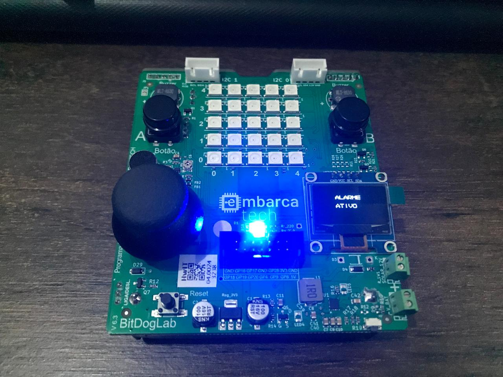
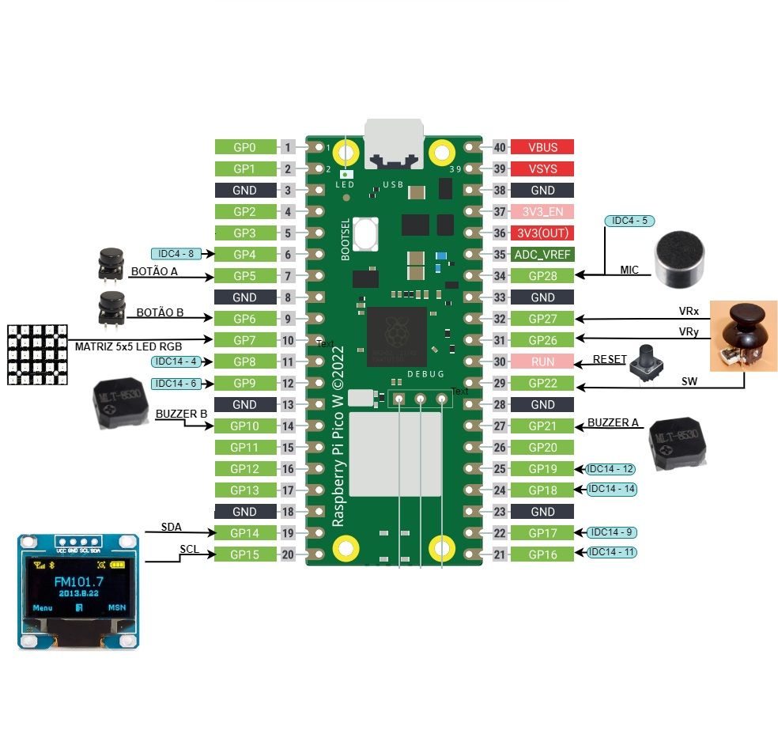
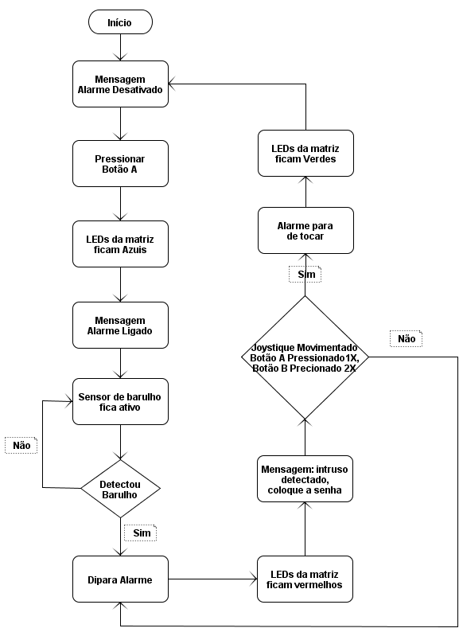

# 📡 Projeto Final - Embarcatech 🚀

## 📌 Sobre o Projeto

Este é o projeto final do curso **Embarcatech**. Ele utiliza a placa **BigDogLab**, que tem como base o **Raspberry Pi Pico W**. A placa já conta com diversos componentes soldados, permitindo o desenvolvimento de soluções embarcadas de forma mais eficiente.

Este projeto implementa um **sistema de alarme inteligente**, que monitora ruídos do ambiente e utiliza LEDs, buzzer e um display OLED para indicar o status do alarme.

## 🛠 Componentes Utilizados

- 🔹 **Placa**: BigDogLab (Raspberry Pi Pico W)
- 🔹 **Display OLED**: Para exibição de mensagens
- 🔹 **LEDs RGB**: Indicadores visuais de status
- 🔹 **Buzzer**: Emissão de alertas sonoros
- 🔹 **Joystick**: Para controle do sistema
- 🔹 **Botões**: Para ativação/desativação do alarme
- 🔹 **Microfone**: Detecção de ruídos ambientais

## ⚙️ Funcionalidades

- ✅ **Ativação/Desativação do Alarme** via botões
- ✅ **Detecção de ruído** para disparar o alarme
- ✅ **Indicação visual** através de LEDs RGB
- ✅ **Exibição de status** no display OLED
- ✅ **Controle via Joystick** para evitar desativações acidentais


## 🚀 Como Executar o Projeto

- 1️⃣ **Configure** a placa BigDogLab com o Raspberry Pi Pico W
- 2️⃣ **Conecte** os componentes de acordo com as definições do código
- 3️⃣ **Compile** o código utilizando o SDK do Raspberry Pi Pico
- 4️⃣ **Faça o upload** do firmware para a placa
- 5️⃣ **Execute** e monitore os status pelo display e LEDs

## 💻 Portas lógicas



## 📝 Fluxograma



## 🏆 Conclusão

Este projeto demonstra a aplicação prática de sistemas embarcados, combinando sensores, atuadores e microcontroladores para criar um **alarme inteligente e responsivo**. 🚨💡

📌 *Projeto desenvolvido como parte do curso Embarcatech.*

🔗 [Acesse o video](https://youtube.com/shorts/o0lpYnt-K90)

## 📜 Código-Fonte
Todo o código-fonte do projeto está disponível no repositório GitHub:
🔗 [Acesse o repositório](https://github.com/rafaelflorentinobarbosa/ProjetoAlarme)

## 📦 Como Baixar e Utilizar
```bash
git clone https://github.com/rafaelflorentinobarbosa.git
```

Após baixar o repositório, basta compilar e carregar o código no **Raspberry Pi Pico W**.

## 📢 Contribuições
Sinta-se à vontade para contribuir com melhorias e sugestões! ✨

---
✍️ **Autor:** Rafael Florentino Barbosa


